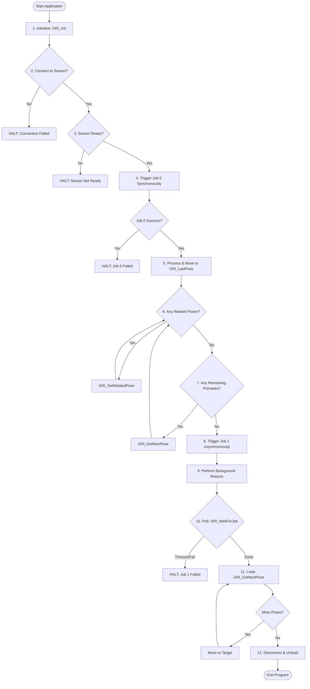

# GRI Application Example Walkthrough (`GRI_APP_EXAMPLE.src`)

This document provides a guide for robot programmers on how to structure a program and communicate with vision sensors using the GRI KRL library. The runnable reference implementation is located in [GRI_APP_EXAMPLE.src](GRI_APP_EXAMPLE.src).

---

## Program Structure & GRI Workflows

The example program demonstrates the lifecycle of a connection and two primary patterns for retrieving targets: **Synchronous Detections** and **Asynchronous Detections**.

### 1. Startup & Connection Lifecycle
Before sending any commands, the robot initializes and opens the communication channel:
*   **`GRI_Init()`**: Call this once at the start of your program. It configures the EKI driver's read timeout (71.0 seconds) and the KRL Euler ZYX pose format (`GRI_PF_KUKA` = `24`) automatically using the default variables in the `.dat` file.
*   **`GRI_Connect()`**: Loads and opens the TCP channel. If this fails (returns `FALSE`), you should halt execution.
*   **`GRI_Status()`**: Ready-check call. It verifies that the vision sensor is online, ready, and has the correct active pipeline.
*   **`GRI_Disconnect()`**: Call this at the end of the program to safely close and unload the EKI socket.

### 2. Synchronous Target Retrieval (Job 0)
The synchronous pattern is recommended when the robot must halt and wait for the sensor calculation before planning any motion.
*   **`GRI_TriggerJobSync(JobId, RobotPose, RemPrimary, RemRelated)`**: 
    *   Triggers job execution (`JobId = 0`) passing the robot's current coordinates.
    *   KRL interpreter execution **blocks** until the sensor finishes calculation and returns the first primary pose in `GRI_LastPose`.
    *   Populates reference variables for remaining poses (`RemPrimary` and `RemRelated`).
*   **Consuming Remaining Poses**:
    *   **`GRI_GetRelatedPose(JobId, RemRelated)`**: Retrieves the next related pose (e.g., pre-pick positions or orientation variants) for the current target.
    *   **`GRI_GetNextPose(JobId, RemPrimary, RemRelated)`**: Retrieves the next primary target pose from the queue once the previous target and its related poses have been processed.

### 3. Asynchronous Target Retrieval (Job 1)
The asynchronous pattern allows the robot to perform motions or other background tasks (like returning to a safe home position) while the sensor calculates in parallel.
*   **`GRI_TriggerJobAsync(JobId, RobotPose)`**: Triggers the job (`JobId = 1`) and **immediately returns control** to the KRL interpreter without waiting.
*   **Parallel Execution**: While the sensor computes in the background, the robot can execute other movements.
*   **`GRI_WaitForJob(JobId, MaxPolls, DelayMs)`**: Blocks and polls the sensor in a non-blocking loop (using EKI status checks) until the job finishes or times out.
*   **Processing Targets**:
    *   Once `GRI_WaitForJob` returns `TRUE`, the robot loops and consumes targets from the queue using `GRI_GetNextPose` until they are exhausted.

---

## Logical Flow Diagram

